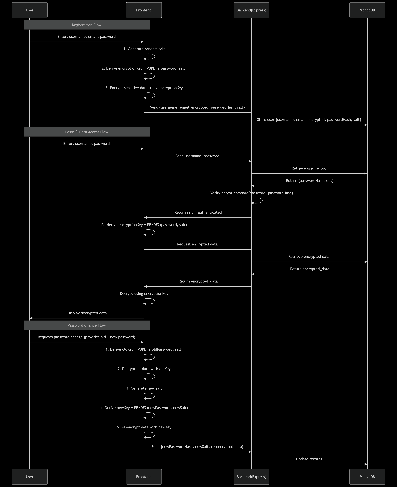

# CertiNova - Bulk Certificate Generation Platform

A comprehensive, secure, and user-friendly platform for creating, managing, and distributing certificates in bulk. CertiNova enables organizations to generate personalized certificates efficiently while maintaining data security through advanced encryption.

## 📖 Table of Contents
- [Overview](#-overview)
- [Key Features](#-key-features)
- [Technology Stack](#-technology-stack)
- [Architecture](#-architecture)
- [Security Features](#-security-features)
- [Installation Guide](#-installation-guide)
- [API Documentation](#-api-documentation)
- [Usage Guide](#-usage-guide)
- [Contributing](#-contributing)

## 🎯 Overview

CertiNova is a full-stack web application designed to streamline the certificate generation process for educational institutions, organizations, and event coordinators. The platform combines intuitive design with robust security features to handle bulk certificate creation while protecting sensitive recipient data.

### Problem Statement
Traditional certificate generation involves:
- Manual creation of individual certificates
- Time-consuming personalization processes
- Security concerns with recipient data storage
- Limited customization options
- Difficulty in managing large recipient lists

### Solution
CertiNova addresses these challenges by providing:
- **Automated Bulk Generation**: Generate hundreds of certificates simultaneously
- **Advanced Security**: End-to-end encryption for recipient data
- **Visual Editor**: Drag-and-drop interface for certificate design
- **Smart Field Positioning**: Precise placement of dynamic content
- **Encrypted Storage**: Password-protected data persistence
- **Modern UI/UX**: Intuitive interface built with modern design principles

## ✨ Key Features

### 🎨 Certificate Design & Management
- **Visual Certificate Editor**: Drag-and-drop interface for positioning fields
- **Template Upload**: Support for custom certificate templates
- **Dynamic Field Mapping**: Name, organization, QR codes, rankings, and custom fields
- **Real-time Preview**: Live preview of certificate layouts
- **Responsive Design**: Works seamlessly on desktop and mobile devices

### 🔒 Advanced Security
- **AES-256 Encryption**: Client-side and server-side data encryption
- **PBKDF2 Key Derivation**: Password-based encryption with salt
- **Secure Password Management**: bcrypt hashing for user authentication
- **Encrypted Data Storage**: All recipient data encrypted before database storage
- **Password-Protected Access**: Generated certificates require passwords to decrypt

### 📊 Data Management
- **Bulk Processing**: Handle large recipient lists efficiently
- **CSV/Excel Import**: Import recipient data from spreadsheets
- **Encrypted Caching**: Smart caching system for performance
- **Search & Filter**: Advanced search and filtering capabilities
- **Pagination**: Efficient handling of large datasets

### 🚀 Performance & Scalability
- **Modern Architecture**: Separation of concerns with REST API
- **Optimized Database**: Efficient MongoDB schemas with indexing
- **File Upload Handling**: Multer-based secure file processing
- **Background Processing**: Efficient bulk operations
- **Error Handling**: Comprehensive error management and logging

## 🛠 Technology Stack

### Backend (certinova-backend)
- **Runtime**: Node.js 20+
- **Framework**: Express.js 5.1.0
- **Database**: MongoDB with Mongoose ODM 8.17.1
- **Authentication**: bcrypt 6.0.0 for password hashing
- **File Upload**: Multer 2.0.2 for template handling
- **Encryption**: Node.js crypto module with AES-256-CBC
- **Middleware**: CORS, express-json, custom error handling
- **Environment**: dotenv for configuration management

### Frontend (certinova-frontend)
- **Framework**: Next.js 15.4.6 (App Router)
- **Runtime**: React 19.1.0
- **Language**: TypeScript 5
- **Styling**: Tailwind CSS 4.0.0-beta.12
- **UI Components**: Radix UI primitives (extensive library)
- **Animations**: Framer Motion 11.18.0
- **Encryption**: CryptoJS 4.2.0 for client-side encryption
- **Canvas Operations**: HTML5 Canvas for certificate generation
- **State Management**: React Context API
- **Icons**: Lucide React icons

### Development Tools
- **Package Manager**: npm
- **Dev Server**: nodemon for backend development
- **TypeScript**: Full TypeScript support with strict mode
- **ESLint**: Code linting and formatting
- **PostCSS**: CSS processing and optimization

## 🏗 Architecture

### System Overview
```
┌─────────────────┐    ┌─────────────────┐    ┌─────────────────┐
│   Frontend      │    │    Backend      │    │    Database     │
│   (Next.js)     │◄──►│   (Express)     │◄──►│   (MongoDB)     │
│                 │    │                 │    │                 │
│ • React 19      │    │ • REST API      │    │ • User Data     │
│ • TypeScript    │    │ • Encryption    │    │ • Events        │
│ • Tailwind CSS  │    │ • File Upload   │    │ • Certificates  │
│ • Client Crypto │    │ • Validation    │    │ • Encrypted     │
└─────────────────┘    └─────────────────┘    └─────────────────┘
```

## Diagram



### Database Schema
```
Users Collection:
├── organisation (String, required)
├── email (String, required, unique)
├── password (String, hashed)
└── timestamps

Events Collection:
├── organisation (String, required)
├── organisationID (ObjectId, ref: User)
├── eventName (String, required)
├── issuerName (String, required)
├── date (Date)
└── timestamps

CertificateConfig Collection:
├── eventId (ObjectId, ref: Event)
├── imagePath (String, template path)
├── validFields (Object, field coordinates)
└── timestamps

GeneratedCertificate Collection:
├── certificateId (ObjectId, ref: CertificateConfig)
├── noOfRecipient (Number)
├── rank (Boolean, has ranking data)
├── encryptedRecipients (Object)
│   ├── encryptedData (String, AES encrypted)
│   ├── salt (String, PBKDF2 salt)
│   └── iv (String, initialization vector)
├── generatedBy (ObjectId, ref: User)
└── timestamps
```

### API Architecture
- **RESTful Design**: Clean, consistent API endpoints
- **Modular Structure**: Separated routes, controllers, models
- **Middleware Pipeline**: Authentication, validation, error handling
- **File Upload**: Secure template upload with validation
- **Error Handling**: Comprehensive error responses with appropriate status codes

## 🔐 Security Features

### Encryption Implementation
- **Algorithm**: AES-256-CBC for data encryption
- **Key Derivation**: PBKDF2 with SHA-256 (10,000 iterations)
- **Salt Generation**: Cryptographically secure random salts
- **IV Generation**: Unique initialization vectors for each encryption
- **Client-Side Encryption**: CryptoJS for frontend encryption
- **Server-Side Encryption**: Node.js crypto for backend operations

### Data Protection
- **Recipient Data**: All recipient information encrypted before storage
- **Password Security**: bcrypt with salt rounds for user passwords
- **Database Security**: No plain text sensitive data stored
- **Memory Management**: Secure cleanup of sensitive data in memory
- **CORS Protection**: Configured cross-origin resource sharing

### Access Control
- **User Authentication**: Organization-based user system
- **Password Requirements**: Minimum 6 characters for encryption passwords
- **Session Management**: Secure user session handling
- **Data Isolation**: Organization-based data separation

## 🚀 Installation Guide

### Prerequisites
- Node.js 20.x or higher
- npm or yarn package manager
- MongoDB 5.x or higher
- Git for version control

### Backend Setup
```bash
# Navigate to backend directory
cd certinova-backend

# Install dependencies
npm install

# Create environment variables
cp .env.example .env
# Edit .env with your configuration:
# PORT=5000
# MONGODB_URI=mongodb://localhost:27017/certinova
# NODE_ENV=development

# Start development server
npm run dev
```

### Frontend Setup
```bash
# Navigate to frontend directory
cd certinova-frontend

# Install dependencies
npm install

# Create environment variables
cp .env.local.example .env.local
# Edit .env.local with your configuration:
# NEXT_PUBLIC_API_URL=http://localhost:5000/api

# Start development server
npm run dev
```

### Database Setup
```bash
# Start MongoDB service
sudo systemctl start mongod  # Linux
brew services start mongodb  # macOS

# The application will create collections automatically
```

### Production Deployment
```bash
# Backend
npm run build
npm start

# Frontend
npm run build
npm start
```

## 📚 API Documentation

### Authentication Endpoints
```http
POST /api/auth/signup
POST /api/auth/login
```

### Event Management
```http
POST /api/events/addEvent
GET /api/events/:organisationId
```

### Certificate Configuration
```http
POST /api/certificates/addCertificateConfig
GET /api/certificates/config/:eventId
PUT /api/certificates/config/:configId
POST /api/certificates/upload-template
```

### Certificate Generation & Storage
```http
POST /api/certificates/storeGenerated
GET /api/certificates/generated
POST /api/certificates/generated/decrypt
```

### Example API Usage
```javascript
// Create a new event
const eventResponse = await fetch('/api/events/addEvent', {
  method: 'POST',
  headers: { 'Content-Type': 'application/json' },
  body: JSON.stringify({
    organisation: "Tech Conference 2025",
    organisationID: "userId123",
    eventName: "Annual Developer Conference",
    issuerName: "Tech Solutions Inc",
    date: "2025-06-15T10:00:00.000Z"
  })
});

// Store encrypted certificate data
const storeResponse = await fetch('/api/certificates/storeGenerated', {
  method: 'POST',
  headers: { 'Content-Type': 'application/json' },
  body: JSON.stringify({
    certificateId: "configId123",
    recipients: [
      { name: "John Doe", email: "john@example.com", rank: "Gold" },
      { name: "Jane Smith", email: "jane@example.com", rank: "Silver" }
    ],
    generatedBy: "userId123",
    password: "securePassword123"
  })
});
```

## 📋 Usage Guide

### 1. Getting Started
1. **Sign Up**: Create an organization account
2. **Create Event**: Add a new event with details
3. **Upload Template**: Upload your certificate template image
4. **Configure Fields**: Position dynamic fields on the certificate

### 2. Certificate Design
1. **Visual Editor**: Use drag-and-drop to position fields
2. **Field Types**: Configure name, organization, QR codes, rankings
3. **Styling**: Customize fonts, colors, and formatting
4. **Preview**: Real-time preview of your certificate layout

### 3. Bulk Generation
1. **Import Recipients**: Upload CSV/Excel with recipient data
2. **Review Data**: Verify recipient information
3. **Set Password**: Choose a strong encryption password
4. **Generate**: Bulk generate all certificates
5. **Download**: Download individual or ZIP files

### 4. Data Management
1. **View History**: Browse previously generated certificates
2. **Search & Filter**: Find specific certificates quickly
3. **Decrypt Data**: Access encrypted recipient information
4. **Export Options**: Download certificates in various formats

## 🤝 Contributing

### Development Workflow
1. Fork the repository
2. Create a feature branch: `git checkout -b feature/amazing-feature`
3. Make your changes following our coding standards
4. Test your changes thoroughly
5. Commit with descriptive messages: `git commit -m 'Add amazing feature'`
6. Push to your fork: `git push origin feature/amazing-feature`
7. Submit a Pull Request

### Code Standards
- **TypeScript**: Strict mode enabled, proper typing
- **ESLint**: Follow configured linting rules
- **Naming**: Use descriptive variable and function names
- **Comments**: Document complex logic and algorithms
- **Testing**: Include tests for new features

### Security Guidelines
- Never commit sensitive data (API keys, passwords)
- Follow encryption best practices
- Validate all user inputs
- Use prepared statements for database queries
- Implement proper error handling without exposing internals

## 📄 License

This project is licensed under the MIT License - see the [LICENSE](LICENSE) file for details.

## 🙏 Acknowledgments

- **Radix UI**: For comprehensive UI components
- **Tailwind CSS**: For utility-first styling
- **Framer Motion**: For smooth animations
- **MongoDB**: For flexible document storage
- **Next.js**: For React framework with excellent developer experience

---

**Built with ❤️ for efficient and secure certificate management**
