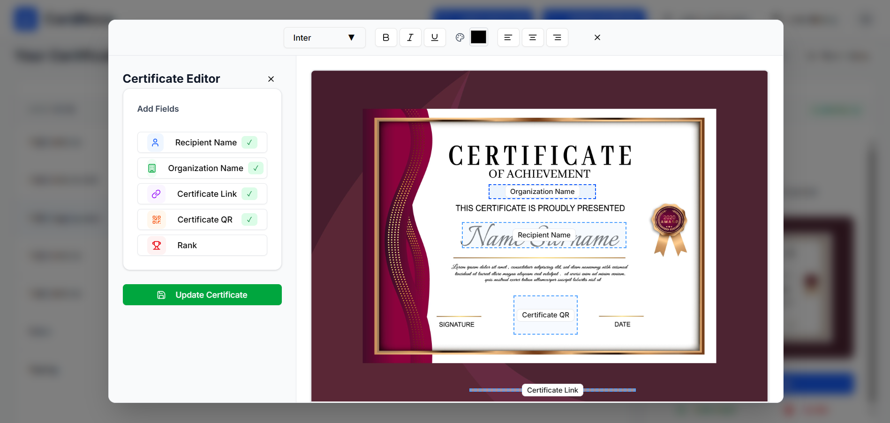
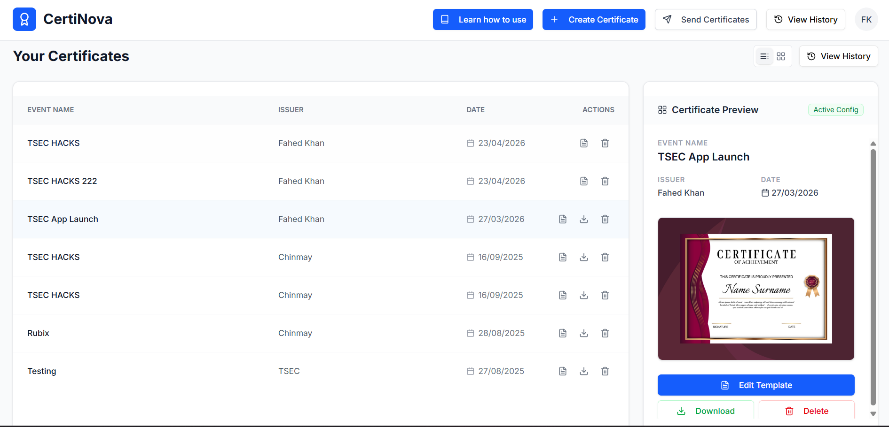
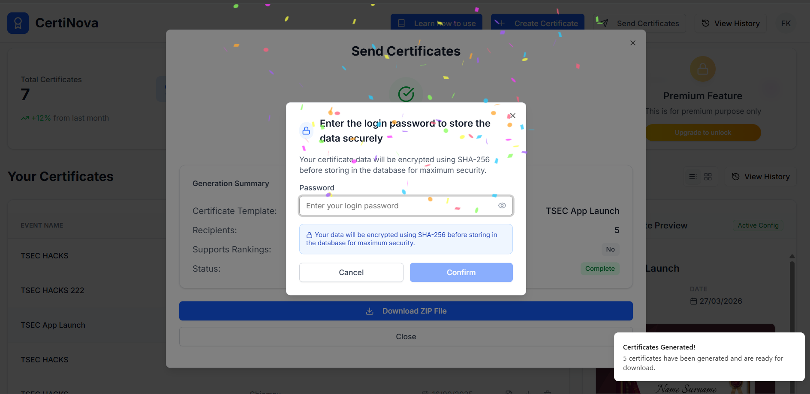
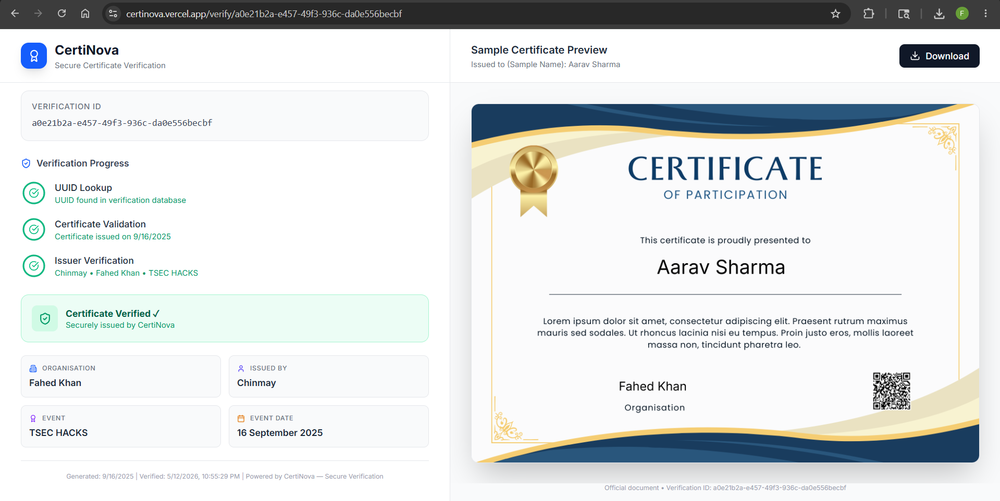
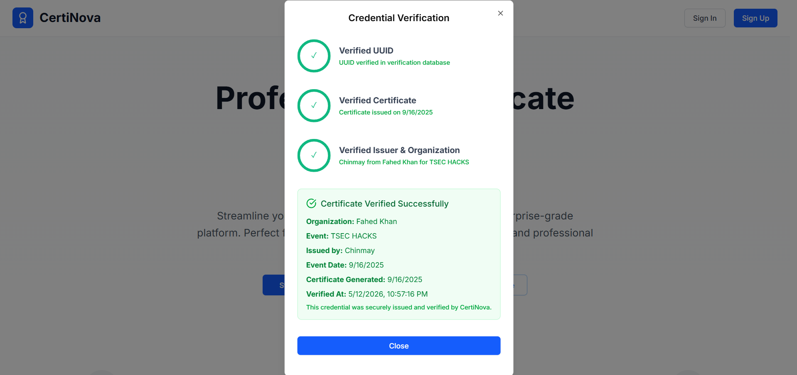
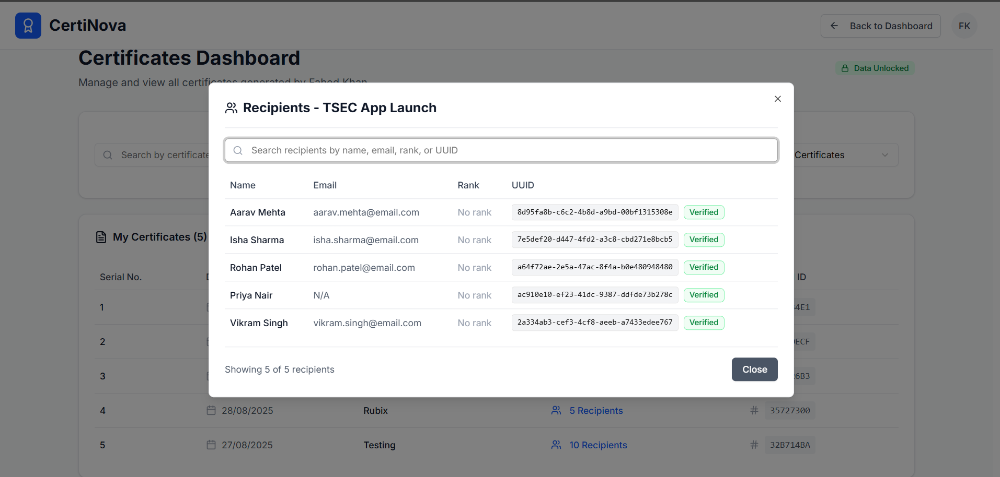
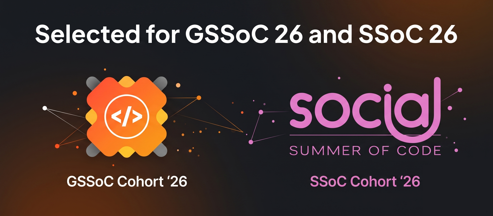

<p align="center">
  
  <p align="center">
    A comprehensive, secure, and user-friendly platform for creating, managing, 
    <br>
    and distributing certificates in bulk. CertiNova enables organizations to 
    <br>
    generate personalized certificates efficiently while maintaining data security 
    <br>
    through advanced encryption.
  </p>
</p>

<p align="center">
  <a href="https://youtu.be/M2zUsVVCerY?si=finYa98RH25MawVP">
    
  </a>
  <a href="https://discord.gg/sQ4sSMRjP">
    
  </a>
</p>

<p align="center">
  
</p>

---

## Table of Contents

- [Overview](#overview)
- [Key Features](#key-features)
- [Security & Privacy](#security--privacy)
- [Technology Stack](#technology-stack)
- [Architecture](#architecture)
- [Getting Started](#getting-started)
- [Community & Support](#community--support)
- [License](#license)
- [Open Source Programs](#the-project-is-officially-selected-for-gssoc-2026--ssoc-2026-contributions)

---

## Overview

CertiNova is a full-stack web application designed to streamline the certificate generation process for educational institutions, organizations, and event coordinators. The platform combines intuitive design with robust security features to handle bulk certificate creation while protecting sensitive recipient data.

### Problem Statement

Traditional certificate generation involves:

- Manual creation of individual certificates
- Time-consuming personalization processes
- Security concerns with recipient data storage
- Limited customization options
- Difficulty in managing large recipient lists

### Solution

CertiNova addresses these challenges by providing:

- **Automated Bulk Generation**: Generate hundreds of personalized certificates simultaneously
- **Advanced Security**: End-to-end AES-256 encryption for all recipient data
- **Visual Editor**: Drag-and-drop interface for certificate design
- **Smart Field Positioning**: Precise placement of dynamic content with live preview
- **URL-based Verification**: Public-facing verifiable certificate links
- **Modern UI/UX**: Intuitive, premium interface built with modern design principles

---

## Key Features

### Certificate Design Studio

<p align="center">
  
</p>

- **Visual Drag-and-Drop Editor** for precise placement of certificate fields
- **Custom Template Upload** — bring your own certificate background via image upload
- **Dynamic Field Types**: Recipient Name, Organisation Name, Rank/Position, Certificate Link, QR Code
- **Typography Controls**: Custom font family, weight, style, color per field
- **Live Preview Mode**: See your certificate rendered exactly as it will be generated
- **Edit Existing Templates**: Modify previously saved certificate configurations

### Dashboard

<p align="center">
  
</p>

- **Grid View**: Card-based certificate overview with thumbnail previews
- **Table View**: Compact list view with quick action buttons per row
- **Preview Pane**: Windows File Explorer-style detail panel — click any event in table view to see the certificate preview and all actions on the right
- **Statistics Cards**: Quick summary of total certificates, recipients, success rate, active events
- **One-click Actions**: Edit, Download Sample, and Delete directly from both views

### Bulk Certificate Generation.

<p align="center">
  
</p>

- **Manual Recipient Entry**: Add recipients one by one with name, email, and rank
- **CSV/Excel Import**: Bulk-import recipient lists via spreadsheets
- **QR Code Embedding**: Auto-generates personalized QR codes linking to the certificate's verification URL
- **Certificate Link Field**: Embeds the unique verification URL directly on the certificate image
- **ZIP Download**: Download all generated certificates as a single `.zip` file
- **Individual Downloads**: Download specific recipient certificates directly
- **Confetti Celebration**: Visual feedback on successful bulk generation
- **Password-Protected Generation**: All recipient data encrypted before storage

### Certificate Verification

#### URL-based Verification (`/verify/{UUID}`)

<p align="center">
  
</p>

- **Public Shareable Links**: Every certificate has a unique URL in the format `{BASEURL}/verify/{UUID}`
- **No Login Required**: Fully public-facing, anyone can verify a certificate
- **Animated Verification Progress**: Step-by-step visual verification with real-time progress indicators
- **Split-pane Layout**: Verification details on the left; rendered certificate preview on the right
- **Sample Certificate Rendering**: Renders a visual sample certificate using the original template and field configuration (with placeholder identity to protect recipient privacy)
- **QR Code Support**: QR codes on generated certificates link directly to this verification URL
- **Certificate Preview Download**: Download the sample certificate image from the verification page

#### Modal Verification

<p align="center">
  
</p>

- **UUID Input Modal**: Enter a certificate's UUID manually in 5 segmented input boxes
- **Paste Support**: Paste a full UUID (`xxxxxxxx-xxxx-xxxx-xxxx-xxxxxxxxxxxx`) into any box and it auto-populates all segments
- **Auto-focus Progression**: Automatically advances to the next input segment on completion
- **Animated Step Progress**: Circular progress indicators for UUID Lookup, Certificate Validation, and Issuer Verification steps
- **Issuer & Event Details**: Displays organisation, issuer name, event name, and event date on success

### Certificate History

<p align="center">
  
</p>

- **View History**: Browse an archive of all previously generated certificate batches
- **Search & Filter**: Find certificates by event name, date, or recipient count
- **Encrypted Recipient Access**: Decrypt recipient data with the original password to view names and emails
- **Metadata Display**: Shows total recipients, generation date, and batch details

---

## Security & Privacy

CertiNova is built with a **Privacy-by-Design** philosophy:

- **AES-256-CBC Encryption**: All recipient personal data encrypted before database storage using PBKDF2 key derivation (SHA-256, 10,000 iterations) and unique salts and IVs per batch
- **Zero Plain-text Storage**: Recipient names, emails, and ranks are never stored in plain text
- **bcrypt Password Hashing**: All user passwords hashed at cost factor 12
- **Organisation-based Isolation**: Each organisation sees only their own events and certificates
- **Sample Certificates for Verification**: The public verification page renders placeholder identity data (e.g., "Aarav Sharma", "1st") to prove certificate authenticity without exposing any recipient PII

For a full security architecture breakdown, see [`certinova-backend/docs/security.md`](./certinova-backend/docs/security.md).

---

## Technology Stack

### Backend — [`certinova-backend`](./certinova-backend/)

| Technology        | Version | Purpose                   |
| ----------------- | ------- | ------------------------- |
| Node.js           | 22+     | Runtime environment       |
| Express.js        | 5.1.0   | REST API framework        |
| MongoDB           | —       | Document database         |
| Mongoose          | 8.17.1  | ODM / schema management   |
| bcrypt            | 6.0.0   | Password hashing          |
| Multer            | 2.0.2   | File upload handling      |
| Cloudinary        | —       | Certificate image hosting |
| crypto (built-in) | —       | AES-256 encryption        |
| dotenv            | —       | Environment configuration |

→ See [`certinova-backend/README.md`](./certinova-backend/README.md) for full backend documentation.

### Frontend — `certinova-frontend`

| Technology      | Version | Purpose                          |
| --------------- | ------- | -------------------------------- |
| Next.js         | 15+     | React framework (App Router)     |
| React           | 19+     | UI library                       |
| TypeScript      | 5       | Type-safe development            |
| Tailwind CSS    | 4       | Utility-first styling            |
| Framer Motion   | 11      | Animations & transitions         |
| Radix UI        | —       | Accessible UI primitives         |
| CryptoJS        | 4.2.0   | Client-side encryption           |
| qrcode          | —       | QR code generation               |
| JSZip           | —       | Bulk ZIP file download           |
| XLSX            | —       | Excel/CSV parsing                |
| uuid            | —       | UUID generation per recipient    |
| canvas-confetti | —       | Celebration effect on generation |
| Lucide React    | —       | Icon library                     |

---

## Architecture


For a detailed breakdown of the backend architecture, directory structure, and data flow diagrams, see [`certinova-backend/docs/architecture.md`](./certinova-backend/docs/architecture.md).

---

## Getting Started

For a complete setup guide — including prerequisites, environment configuration, step-by-step usage, and troubleshooting — see **[GETTING-STARTED.md](./GETTING-STARTED.md)**.

**Quick start:**

```bash
# 1. Clone the repository
git clone https://github.com/12fahed/CertiNova.git
cd CertiNova

# 2. Start the backend
cd certinova-backend && npm install && cp ../.env.example .env
# Edit .env with your MongoDB URI and Cloudinary credentials, then:
npm run dev

# 3. Start the frontend (in a new terminal)
cd certinova-frontend && npm install
# Create .env.local with: NEXT_PUBLIC_API_URL=http://localhost:5000/api
npm run dev
```

---

## Community & Support

Join our growing community to get help, share your feedback, and stay updated:

- **Discord**: [Join our server](https://discord.gg/bMGuKat7e3)
- **Contributing**: Check out our [CONTRIBUTING.md](./CONTRIBUTING.md) for guidelines
- **Code of Conduct**: We follow the [Contributor Covenant](./CODE_OF_CONDUCT.md)

---
## Open Source Programs

The project is officially selected for GSSoC 2026 & SSoC 2026 Contributions.

<p align="center">
  
</p>
## License

This project is licensed under the MIT License.

---

**Built with care for efficient and secure certificate management**
