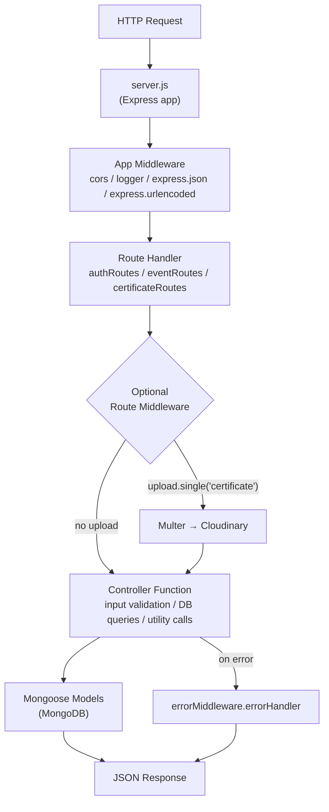
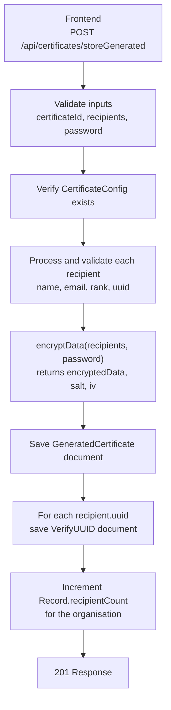
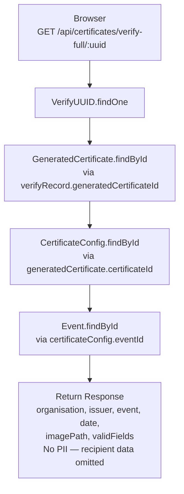

# Architecture Overview

## System Architecture

CertiNova Backend is a RESTful API server built with Node.js and Express.js, following an MVC-inspired layered architecture. It interfaces with a MongoDB database via Mongoose and uses Cloudinary for cloud-based certificate template storage.

## Directory Structure

```
certinova-backend/
├── server.js                    # Application entry point — bootstraps Express, middleware, and routes
├── package.json                 # Project manifest, dependencies, and scripts
│
├── api/
│   └── index.js                 # Vercel serverless function handler
│
├── middleware/
│   └── upload.js                # Re-exports Cloudinary upload middleware (facade)
│
├── src/
│   ├── config/
│   │   ├── database.js          # MongoDB connection initialisation via Mongoose
│   │   └── cloudinary.js        # Cloudinary SDK config + Multer storage adapter
│   │
│   ├── controllers/
│   │   ├── authController.js    # User registration and login logic
│   │   ├── eventController.js   # Event CRUD and cascading deletion
│   │   └── certificateController.js  # Certificate lifecycle — config, generation, verification, stats
│   │
│   ├── middleware/
│   │   ├── appMiddleware.js     # CORS and HTTP request logger
│   │   └── errorMiddleware.js   # Global error handler + 404 handler
│   │
│   ├── models/
│   │   ├── User.js              # Organisation account schema + bcrypt hooks
│   │   ├── Event.js             # Certificate event schema
│   │   ├── CertificateConfig.js # Template image path + field layout schema
│   │   ├── GeneratedCertificate.js  # Encrypted recipient batch schema
│   │   ├── VerifyUUID.js        # Public UUID to certificate mapping schema
│   │   ├── Record.js            # Per-organisation statistics schema
│   │   └── index.js             # Model barrel export
│   │
│   ├── routes/
│   │   ├── authRoutes.js        # POST /api/auth/*
│   │   ├── eventRoutes.js       # GET/POST/DELETE /api/events/*
│   │   ├── certificateRoutes.js # All /api/certificates/* routes
│   │   └── proxyRouter.js       # Legacy / utility proxy routes
│   │
│   └── utils/
│       ├── crypto.js            # AES-256-CBC encrypt/decrypt + SHA-256 hash
│       └── validation.js        # validFields schema validation helpers
│
└── test/
    └── cloudinary-test.js       # Startup Cloudinary configuration smoke test
```

## Layered Request Lifecycle



## Key Design Decisions

| Decision                                    | Rationale                                                                                                                                                                                            |
| ------------------------------------------- | ---------------------------------------------------------------------------------------------------------------------------------------------------------------------------------------------------- |
| **ES Modules (`"type": "module"`)**         | Modern, standards-aligned JS module system used throughout.                                                                                                                                          |
| **No JWT / session tokens**                 | Authentication is currently session-less (password verification per request); JWT is flagged as future work in controller comments.                                                                  |
| **Cloudinary for template images**          | Avoids stateful file storage on the server; public URLs simplify frontend rendering.                                                                                                                 |
| **AES-256-CBC + PBKDF2 for recipient data** | Recipient PII is never stored in plain text; password-gated decryption ensures data privacy.                                                                                                         |
| **Cascading delete in application layer**   | Deletion of an event triggers manual deletion of its `CertificateConfig`, `GeneratedCertificate`, and `VerifyUUID` documents to preserve referential integrity without relying on DB-level cascades. |
| **Record collection for statistics**        | A separate `Record` document per organisation tracks aggregate `eventsCreated` and `recipientCount` for O(1) stat lookups, avoiding expensive aggregation pipelines on hot paths.                    |

## Data Flow: Certificate Generation



## Data Flow: Public Certificate Verification


