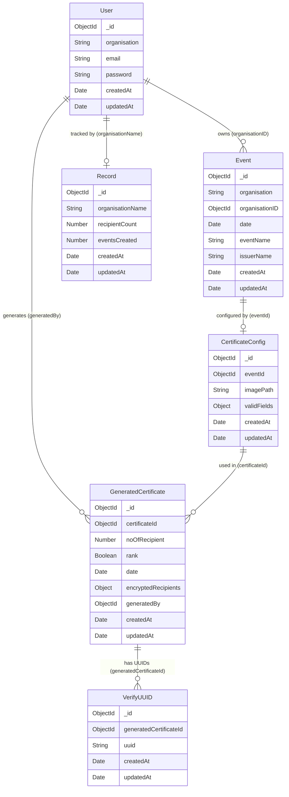

# Data Models

All models are Mongoose schemas backed by MongoDB. Timestamps (`createdAt`, `updatedAt`) are automatically managed by Mongoose on all collections unless noted otherwise.

---

## User

**Collection**: `users`  
**File**: `src/models/User.js`

Represents an organisation account with login credentials.

### Schema

| Field | Type | Required | Constraints | Description |
|---|---|---|---|---|
| `organisation` | `String` | Yes | 2–100 chars, trimmed | Display name of the organisation |
| `email` | `String` | Yes | Unique, lowercase, valid format | Login identifier |
| `password` | `String` | Yes | Min 6 chars | Stored as a bcrypt hash (cost factor 12); never returned in responses |
| `createdAt` | `Date` | — | Auto | Timestamp of account creation |
| `updatedAt` | `Date` | — | Auto | Timestamp of last update |

### Hooks & Methods

- **`pre('save')`** — Automatically hashes the `password` field with bcrypt (cost 12) before any save. Skipped if `password` has not been modified.
- **`comparePassword(candidatePassword)`** — Instance method using `bcrypt.compare` to validate a plain-text password against the stored hash.
- **`toJSON()`** — Strips the `password` field from all serialised output to prevent accidental exposure.

---

## Event

**Collection**: `events`  
**File**: `src/models/Event.js`

Represents a certificate-issuing event (e.g., a workshop, competition, or academic ceremony).

### Schema

| Field | Type | Required | Constraints | Description |
|---|---|---|---|---|
| `organisation` | `String` | Yes | 2–100 chars, trimmed | Denormalised organisation name for quick display |
| `organisationID` | `ObjectId` | Yes | Ref → `User` | Foreign key to the owning user account |
| `date` | `Date` | Yes | Defaults to `Date.now` | The date the event took place |
| `eventName` | `String` | Yes | 2–200 chars, trimmed | Name of the event |
| `issuerName` | `String` | Yes | 2–100 chars, trimmed | Name of the signing authority on certificates |
| `createdAt` | `Date` | — | Auto | — |
| `updatedAt` | `Date` | — | Auto | — |

### Indexes

| Index | Purpose |
|---|---|
| `{ organisationID: 1 }` | Fast lookup of all events for an organisation |
| `{ eventName: 1 }` | Fast search by event name |

---

## CertificateConfig

**Collection**: `certificateconfigs`  
**File**: `src/models/CertificateConfig.js`

Stores the visual layout of a certificate template — the background image URL and the position/style of each dynamic text field. **One config per event (1:1).**

### Schema

| Field | Type | Required | Description |
|---|---|---|---|
| `eventId` | `ObjectId` | Yes — Ref → `Event` | The event this template belongs to |
| `imagePath` | `String` | Yes | Cloudinary URL of the background template image |
| `validFields` | `ValidFieldsSchema` | Yes | Object of named field definitions (see below) |
| `createdAt` | `Date` | — | Auto |
| `updatedAt` | `Date` | — | Auto |

### ValidFields Sub-schema

The `validFields` object may contain any combination of the following **optional** named keys:

| Key | Description |
|---|---|
| `recipientName` | Dynamic recipient name |
| `organisationName` | Issuing organisation name |
| `certificateLink` | Printed verification URL |
| `certificateQR` | QR code image |
| `rank` | Optional rank / position |

Each key maps to a **Field Sub-schema**:

| Property | Type | Required | Constraints | Description |
|---|---|---|---|---|
| `x` | `Number` | Yes | >= 0 | Horizontal pixel offset |
| `y` | `Number` | Yes | >= 0 | Vertical pixel offset |
| `width` | `Number` | Yes | > 0 | Bounding-box width |
| `height` | `Number` | Yes | > 0 | Bounding-box height |
| `fontFamily` | `String` | No | Enum (~50 values), default `"Inter"` | Typeface |
| `fontWeight` | `String` | No | `"normal"` \| `"bold"` | Weight |
| `fontStyle` | `String` | No | `"normal"` \| `"italic"` | Style |
| `textDecoration` | `String` | No | `"none"` \| `"underline"` | Decoration |
| `color` | `String` | No | Hex `#RRGGBB` or `#RGB`, default `"#000000"` | Text colour |

Sub-schemas use `{ _id: false }` — no `_id` is generated for embedded field objects.

### Indexes

| Index | Purpose |
|---|---|
| `{ eventId: 1 }` | Fast config lookup by event |

---

## GeneratedCertificate

**Collection**: `generatedcertificates`  
**File**: `src/models/GeneratedCertificate.js`

Stores metadata about a batch of generated certificates. The recipient list is stored **AES-256-CBC encrypted** and is never accessible without the original password.

### Schema

| Field | Type | Required | Description |
|---|---|---|---|
| `certificateId` | `ObjectId` | Yes — Ref → `CertificateConfig` | Template used to generate this batch |
| `noOfRecipient` | `Number` | Yes — min 1 | Total number of recipients in the batch |
| `rank` | `Boolean` | — default `false` | Whether any recipient in this batch had a rank |
| `date` | `Date` | — default `Date.now` | Generation timestamp |
| `encryptedRecipients` | `Object` | Yes | Encrypted payload (see below) |
| `recipients` | `Array` | No | **Legacy field** — plain-text recipients from pre-encryption era; retained for backward compatibility |
| `generatedBy` | `ObjectId` | Yes — Ref → `User` | The user who initiated generation |
| `createdAt` | `Date` | — | Auto |
| `updatedAt` | `Date` | — | Auto |

### `encryptedRecipients` Structure

Produced by `src/utils/crypto.js::encryptData()`:

| Sub-field | Type | Description |
|---|---|---|
| `encryptedData` | `String` | AES-256-CBC ciphertext (hex-encoded) |
| `salt` | `String` | 16-byte random PBKDF2 salt (hex-encoded) |
| `iv` | `String` | 16-byte random initialisation vector (hex-encoded) |

### Indexes

| Index | Purpose |
|---|---|
| `{ certificateId: 1, date: -1 }` | Paginate batches by template |
| `{ generatedBy: 1, date: -1 }` | Paginate batches by user |

---

## VerifyUUID

**Collection**: `verifyuuids`  
**File**: `src/models/VerifyUUID.js`

Maps a unique UUID (assigned to each individual recipient certificate) to the `GeneratedCertificate` batch it belongs to. Enables the public verification endpoint.

### Schema

| Field | Type | Required | Constraints | Description |
|---|---|---|---|---|
| `generatedCertificateId` | `ObjectId` | Yes — Ref → `GeneratedCertificate` | The batch this UUID belongs to |
| `uuid` | `String` | Yes | Unique, indexed | The per-recipient UUID embedded in the generated certificate |
| `createdAt` | `Date` | — | Auto | — |
| `updatedAt` | `Date` | — | Auto | — |

### Indexes

| Index | Purpose |
|---|---|
| `{ uuid: 1 }` | O(1) UUID lookup for public verification |
| `{ generatedCertificateId: 1 }` | Bulk delete when a batch is removed |

---

## Record

**Collection**: `records`  
**File**: `src/models/Record.js`

Tracks aggregate statistics per organisation. Updated atomically via `$inc` operators to avoid expensive aggregation queries on hot paths.

### Schema

| Field | Type | Required | Constraints | Description |
|---|---|---|---|---|
| `organisationName` | `String` | Yes | Indexed | Organisation display name (matches `Event.organisation`) |
| `recipientCount` | `Number` | — | Default `0`, min `0` | Total recipients issued certificates by this organisation |
| `eventsCreated` | `Number` | — | Default `0`, min `0` | Total events created by this organisation |
| `createdAt` | `Date` | — | Auto | — |
| `updatedAt` | `Date` | — | Auto | — |

### Indexes

| Index | Purpose |
|---|---|
| `{ organisationName: 1 }` | Unique organisation stat lookup |

---

## Entity Relationship Diagram

