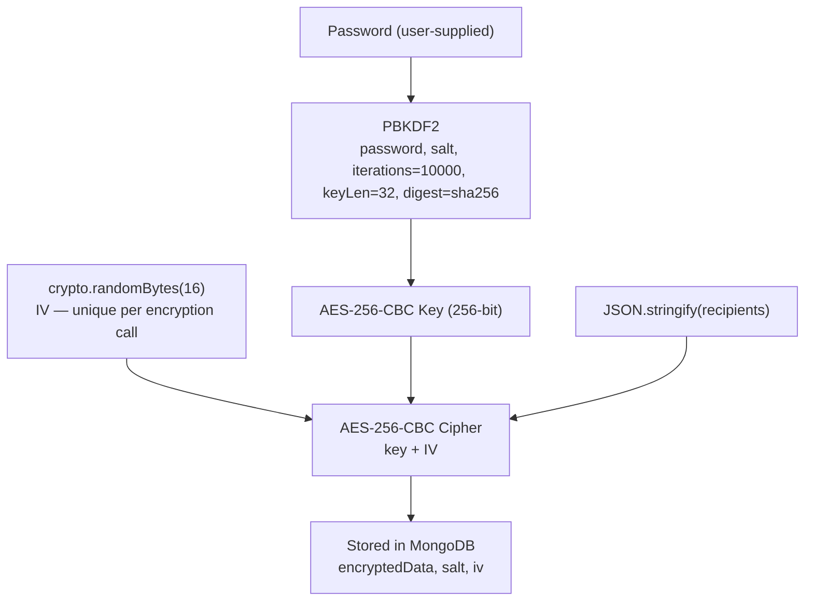

# Security Architecture

CertiNova Backend is built with a **Privacy-by-Design** philosophy. Recipient personal data is treated as sensitive PII and is protected at rest and logically isolated from public-facing APIs.

---

## Recipient Data Encryption

### Overview

All recipient data (names, emails, ranks) is encrypted **before** being persisted to MongoDB. The plain-text data exists only transiently in server memory during a single request and is never written to the database or returned in any API response.

### Algorithm: AES-256-CBC with PBKDF2

**File**: `src/utils/crypto.js`



### Parameters

| Parameter | Value | Rationale |
|---|---|---|
| Cipher | AES-256-CBC | Industry-standard symmetric encryption |
| Key derivation | PBKDF2-SHA256 | Prevents brute-force attacks on weak passwords |
| Iterations | 10,000 | NIST minimum recommendation at time of implementation |
| Key length | 32 bytes (256 bits) | Maximum AES key strength |
| Salt | 16 random bytes | Unique per batch; prevents rainbow table attacks |
| IV | 16 random bytes | Unique per encryption call; ensures identical plaintexts produce different ciphertexts |
| Encoding | Hex | Portable, string-safe storage in MongoDB |

### Decryption

Decryption requires the caller to supply the same password used during encryption. The `salt` stored in the document is used to re-derive the identical key via PBKDF2, which is then used with the stored `iv` to initialise the AES-CBC decipher.

A wrong password produces either garbled JSON (parse error) or an OpenSSL padding error — both are caught and surfaced as `401 Invalid password or failed to decrypt data`.

### Functions

```js
// Encrypt an array/object with a password
encryptData(data: any, password: string): { encryptedData, salt, iv }

// Decrypt a stored package with the original password
decryptData(encryptedPackage: { encryptedData, salt, iv }, password: string): any

// One-way SHA-256 hash (utility — not used for recipient storage)
hashPassword(password: string): string
```

---

## User Password Hashing

**File**: `src/models/User.js`

User login passwords are hashed with **bcrypt** before storage.

| Parameter | Value |
|---|---|
| Algorithm | bcrypt |
| Cost factor | 12 |
| Storage | Hashed string only — plain text is never stored |

The `password` field is excluded from all serialised JSON output via a `toJSON()` Mongoose method override, preventing accidental leakage in API responses or logs.

---

## CORS Policy

**File**: `src/middleware/appMiddleware.js`

Cross-Origin Resource Sharing is enforced based on the deployment environment:

| Environment | Allowed Origins |
|---|---|
| `development` | `http://localhost:3000`, `http://localhost:3001`, `http://127.0.0.1:3000` — and wildcard `*` as fallback |
| `production` | `process.env.FRONTEND_URL`, `https://certinova.vercel.app` |

Allowed methods: `GET, POST, PUT, PATCH, DELETE, OPTIONS`  
Allowed headers: `Origin, X-Requested-With, Content-Type, Accept, Authorization`

---

## Privacy-by-Design: Verification Without PII

The public certificate verification endpoint (`GET /api/certificates/verify-full/:uuid`) is designed to prove certificate authenticity **without revealing any personal recipient information**:

- The endpoint returns the organisation name, issuer name, event name, event date, and the certificate template layout (`imagePath`, `validFields`).
- The frontend renders a **sample certificate** using placeholder identity data (e.g., "Aarav Sharma", "1st") in place of the actual recipient's details.
- The real recipient data remains encrypted in the database and is never included in verification responses.

This design allows public, unauthenticated verification while fully complying with data minimisation principles.

---

## File Upload Security

**File**: `src/config/cloudinary.js`  
**Middleware**: `middleware/upload.js` — Multer + `multer-storage-cloudinary`

| Control | Detail |
|---|---|
| Allowed MIME types | `image/*` only — enforced via Multer `fileFilter` |
| Maximum file size | 10 MB |
| Storage location | Cloudinary CDN (`certinova/certificate-templates/` folder) |
| Local storage | None — files go directly to Cloudinary and are never written to the server filesystem |
| Filename | Server-controlled: `template-{timestamp}-{originalname}` — prevents path traversal |

---

## Input Validation

**File**: `src/utils/validation.js`

All field-layout inputs (`validFields`) are validated before being persisted:

- **Allowed field names**: `recipientName`, `organisationName`, `certificateLink`, `certificateQR`, `rank` — any unknown key is rejected.
- **Coordinate validation**: `x`, `y`, `width`, `height` must be finite numbers; coordinates non-negative; dimensions positive.
- **Font family**: Must be one of an explicit allowlist of ~50 font families — free-form strings are rejected.
- **Colour**: Must match the regex `^#([A-Fa-f0-9]{6}|[A-Fa-f0-9]{3})$`.
- **ObjectId format**: All ID parameters are validated with `/^[0-9a-fA-F]{24}$/` before any database query.
- **Email format**: Recipient emails are validated with a standard regex before encryption.

---

## Error Handling Strategy

**File**: `src/middleware/errorMiddleware.js`

| Scenario | Behaviour |
|---|---|
| Unhandled route | `notFound` middleware passes a 404 error to `errorHandler` |
| Application errors | `errorHandler` catches all errors via Express's 4-argument signature |
| Stack traces | Only included in responses when `NODE_ENV === 'development'` |
| Sensitive error messages | Production responses use generic messages; detailed errors are only logged server-side |

---

## Known Limitations & Future Improvements

| Area | Current State | Recommended Improvement |
|---|---|---|
| **Authentication** | Session-less; user ID passed in request body | Implement JWT or session tokens to authenticate all protected endpoints |
| **Authorisation** | No server-side ownership checks on events/certificates | Add middleware to verify `organisationID` matches the authenticated user |
| **PBKDF2 iterations** | 10,000 | Increase to 600,000 or more per current OWASP guidelines |
| **Rate limiting** | Not implemented | Add `express-rate-limit` on auth and generation endpoints |
| **Audit logging** | Console only | Implement structured logging (e.g., Winston/Pino) with log rotation |
